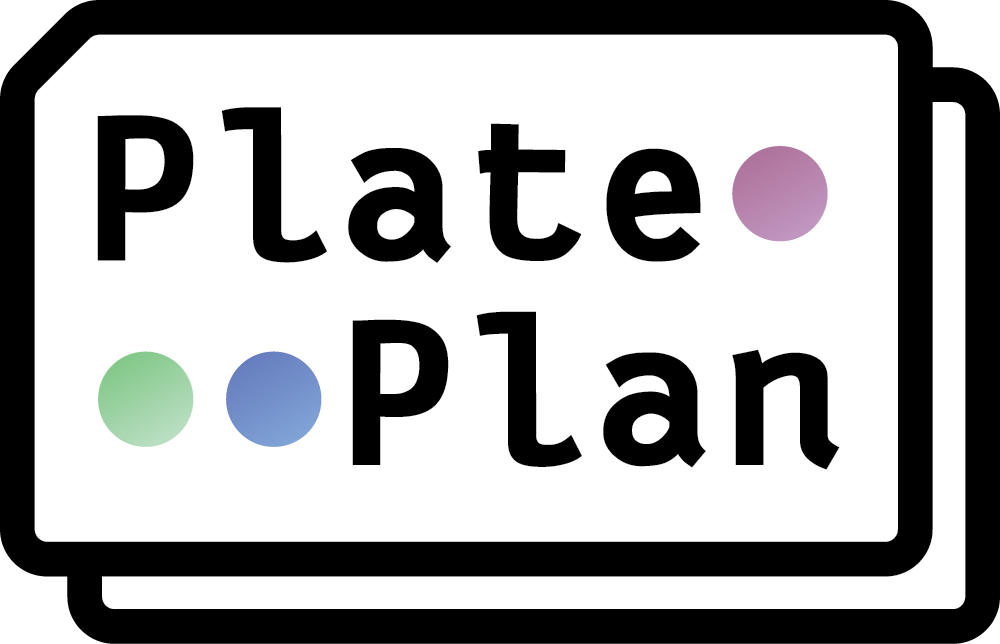
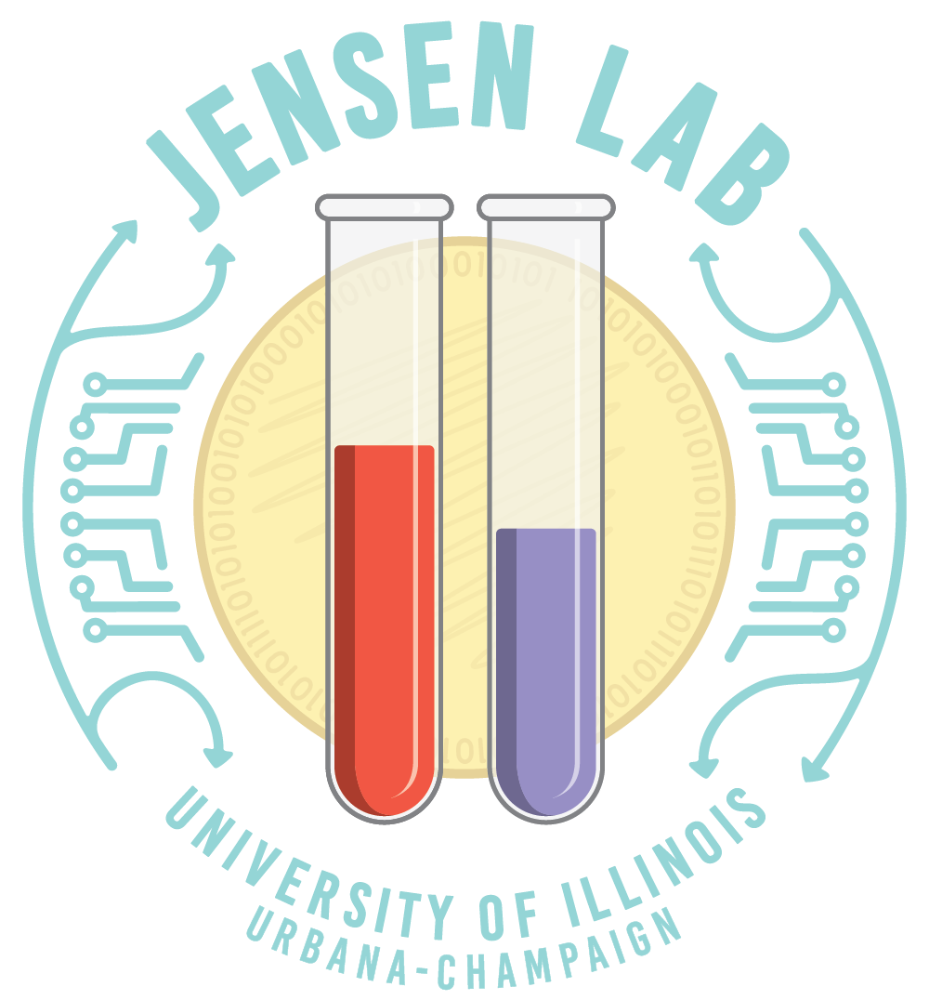

# Welcome to PlatePlan
PlatePlan is the bridge between your hypotheses and results. In order to make that jump, a lot goes into the logistics and planning out an experiment, from how many multi-well plates to use and where to dispense each reagent, to which reagents to batch together and how much volume to dispense. These logistics are especially challenging in the case of high-throughput, combinatorial assays where you may have tens of thousands of unique dispenses to manage and keep track of. 

PlatePlan takes some of that burden away from the experimenter by handling those logistics for you. It has been tailored to our lab's set up ([Jensen Lab, UIUC](http://www.jensenlab.net)) to take advantage of the [Formulatrix Mantis](https://formulatrix.com/liquid-handling-systems/mantis-liquid-handler/) liquid handling robot for combinatorial bacteria growth assays, but can be adapted to fit another use case with relative ease. 

It does so by generalizing an experimental structure into Python objects, explained further in depth in **[Structure](#structure)**. We've tried to make it easy for an experimenter to get started. To make an experiment, you must make a protocol interfacing with the PlatePlan package in the form of a `.py` file. The biggest hurdle to use PlatePlan is determining what final solutions you want your liquid handler to complete for you--this comes in the form of a list of Solutions that each map a Reagent to its final concentration. Beyond inputting a few extra experimental parameters like how many replicates or blanks you need, that's it.

You can refer to **[Running an Experiment](#running-an-experiment)** for more detailed requirements and instructions or look at our sample experiment in `templates/l2o_amino_acids.py` which is an experiment we've developed to perform a large scale leave-two-out growth assay for amino acids in a chemically defined medium ([CDM](https://en.wikipedia.org/wiki/Chemically_defined_medium)). A simpler example experiment is also located in `templates/pair_combos.py` and used as the example code for the sections below.

# Software requirements
1. Clone this repo using `git clone https://github.com/jensenlab/PlatePlan.git`
2. run `cd PlatePlan` to enter the directory
3. You need a Pipenv virtual environment for this project
	* 2.1. Install [pipenv](https://pipenv-fork.readthedocs.io/en/latest/install.html), a Python virtual environment manager 
	* 2.2. run `pipenv --python 3.6` in the root project directory to initialize a Pipenv environment
	* 2.3. run `pipenv install` in the root project directory to install the required dependencies
	* 2.4. run `pipenv shell` in the root project directory to enter the virtual environment. You should see a `(PlatePlan)` prefix in the terminal to indicate you are in a virtual environment
4. A copy of [Gurobi optimizer](https://www.gurobi.com/) must be installed in your environment, with the [Python interface](https://www.gurobi.com/documentation/quickstart.html) set up
	* 4.1. Install Gurobi on your computer and activate the license. Once this is completed, set up the Python interface for the Pipenv virtual environment below
	* 4.2. In the `(PlatePlan)` virtual environment, run `which python` and copy this path
	* 4.3. `cd` to the install location of your Gurobi install. On Linux it might be similar to `/opt/gurobi811/`
	* 4.4. `cd linux64`
	* 4.5. Paste your copied path from Step 4.2 `[copied Python path] setup.py install`. Depending on your path location, you may need elevated permissions. If so, add `sudo` before the command
	* 4.6. If necessary (Linux), set up your environment variables according to the Quickstart Guide in Step 4
	* 4.7 To test if it installed correctly, run `python` to start a Python shell in your terminal. Then run `import gurobipy`. If there are no errors, the Gurobi interface has installed successfully!
5. You are ready to make your first PlatePlan protocol
# Structure
In order to define an experiment, the user needs to define the input **Ingredients**: **Solutions**, **Reagents**, and **Stocks**. Stocks represent the physical analog of Solutions which are virtual themselves. Solutions can consist of single or multiple reagents, as long as you define a concentration for each. 

## Ingredients
### Reagents
Reagents are the smallest unit of the experiment you are planning, usually a singular component/reagent. They have 3 
properties: 

`id`: An identifier string of the reagent, e.g. 'sodium_chloride'

`name`: A secondary name of the reagent, e.g. 'NaCl'

`molecular_weight`: A string of the molecular weight, e.g. '58.44 g/mol'

### Solutions
Solutions are composed of one or more `Reagent.id` and their concentrations in solution. Solutions represent both the solutions you are dispensing and the solutions you are trying to make. They are composed of 3 components:
properties: 

`id`: A string of the solution name, e.g. 'sodium_chloride'

`reagents`: A dictionary mapping Reagent.id -> concentration (as string), e.g. 

     {
	       'sodium_chloride' : '50 mg/L',
	       'sodium_carbonate' : '50 mg/L'
	 }

`solvent`: A string of the solvent

### Stocks
Stocks contain a single Solution with additional real-world laboratory information, useful for inventory and management. They are composed of the following attributes:

`ingredient`: The corresponding Solution object

`id`: The ID of this new stock

`quantity`: The volume of the stock you have stored

`labware`: The type of labware the stock is stored in

`location`: The location of the stock

`date_made`: The date the stock was made

`date_expires`: The expiry date of the stock

## Example experiment set up using stocks and solutions
For this example experiment, we will make all combinations of 2 of the following three amino acids:
**alanine, arginine, aspartic acid**. We have them stored as 100x stocks in our lab. And the final concentration of each will be 10 mg/ml. We need to generate 3 Reagents (alanine, arginine, aspartic acid) , 3 100x Solution Stocks (**alanine stock, arginine stock, aspartic acid stock**), and 3 Solutions to make (**alanine+arginine, alanine+aspartic acid, arginine+aspartic acid**).

#### Generate 3 Solution Stocks:
	"""pair_combos.py"""
	from plateplan import (
		constants, ingredients, makeids, mantis, mapper, scheduling, units
	)
	
	amino_acid_ids = ["ALA", "ARG", "ASP"]
	amino_acid_names = ["alanine", "arginine", "aspartic acid"]
	final_conc = {
		"ALA": "10 mg/ml",
		"ARG": "10 mg/ml",
		"ASP": "10 mg/ml"
	}
	
	reagents = {}
	stocks = {}
	
	# Define stock solutions and reagents
    for i in range(3):
	    id_ = amino_acid_ids[i] # Get id value
	    name = amino_acid_names[i] # Get name value
	    conc = str(units.parse(final_conc[id_]) * 100) #Get 100x stock conc value
	    
		reagents[id_] = ingredients.Reagent(id_=id_,  name=name) # Not used in this experiment
		soln = ingredients.Solution(reagents={id_: conc},  id_=id_+"_stock") # Make solution
		
		stocks[id_] =  ingredients.Stock(
			ingredient=soln,
			date_made=datetime.date.today(), #Today's date
			date_expires=datetime.date.today() + datetime.timedelta(6  *  365  /  12), # +6 months for expiry date
			quantity=units.parse("10 ml"), # Amount of stock we have stored
			labware="Conical15ml", # What its stored in
		) # Make stock from Solution, soln and add it to stocks list
	
	...
	
#### Generate Solutions to Make:
	"""pair_combos.py"""
	...
	
	solutions = []
	# Define solutions you want to make
	pairs = [["ALA", "ARG"], ["ALA", "ASP"], ["ARG", "ASP"]]
	for first, second in pairs:
		reagents = {
			first: final_conc[first],
			second: final_conc[second]
		}
		id_ = first + "_" + second + "_mixture"
		soln = ingredients.Solution(reagents=reagents,  id_=id_) # Make solution
		solutions.append(soln)
	
	# Add water to solutions so we can use it as a blank
	water = ingredients.Solution(reagents={"water":  "0 g/l"},  id_="water") # Make solution
	solutions.append(water)

	...

# Running an Experiment
Once you have generated all the necessary Solutions and Stocks needed to run the experiment, you must now define the other experiment parameters and run the scheduler.
### Defining your experiment parameters

`solutions`: list of ingredients.Solutions you want to make. Each one of these Solutions.&#8203;id must be present in a Stock in `stocks` below.

`strains`: list of str of the bacteria you want to use

`environments`: list of str of the environments you want to grow in

`stocks`: list of ingredients.Stocks that you have for dispensing

`plate`: a constants.labware Labware plate, e.g. constants.labware["WP384"] for 384-well plate

`replicates`: int number of replicates 

`plate_control`: tuple of (Solution.&#8203;id, quantity) to use for the control, e.g. ("CDM",  1). This Solution.&#8203;id *MUST* be a solution given in 

`solutions`. The scheduler **will not** make any extra wells of the control Solution, but rather uses the actual Solution dispenses as the control wells, unlike the blanks.

`plate_blank`:  tuple of (Solution.&#8203;id, quantity) to use for the blank, e.g. ("CDM",  1). This Solution.&#8203;id *MUST* be a solution that exists in the `solutions` . The scheduler **will** make `quantity * replicates` number of extra wells of the blank Solution to use as the blank wells, unlike the controls.

`randomize`: boolean flag to set if replicates should have randomized locations within the plate (replicates will always be placed on the same plate)
`plate_prefix`: str to add to the plate name

`total_volume`: str of volume in each well, e.g. "80 ul"

`working_volume`: str of the working volume in each well, e.g. "80 ul"

`min_drop_size`: str of the volume corresponding to the maximum resolution for your liquid handler, e.g. "0.1 ul"

`quantity_units`: str of concentration unit to use for liquid handler, e.g. "ug/ul"

`excess`: str of reagent to use to input for excess volume/to get to the correct concentrations, e.g. "water"

`max_stocks`: int of the maximum number of stocks you can load at a time in your liquid handler, e.g. 24 (we use a Formulatrix Mantis + LC3)

### Example scheduler run
	"""pair_combos.py"""
	
	...
	
	# Schedule the experiments with your parameters
	plates, instructions, layout = scheduling.schedule_mantis(
	    solutions,
	    [constants.strains["SMU"]],
	    ["aerobic"],
	    stocks,
	    excess="water",
	    plate=constants.labware["WP384"],
	    total_volume="80 ul",
	    working_volume="78 ul",
	    plate_control=("ALA_ARG_mixture",  5), # We'll define the ALA/ARG mixture as the control
	    plate_blank=("water",  5),
	    replicates=10, 
	    min_drop_size="0.1 ul"
	)
	
	...

# Tools
We have created a few tools for the user to take advantage of. Some are used by the scheduler.
## Units 
Makes conversions between units easier and automatic. It is used by internally by the scheduler and by the user when defining experiments. You are able to perform arithmetic and conversions between magnitudes of the same unit and into other units types entirely.

Almost all quantities for PlatePlan require units. Rather than store
units separately and manage conversions case-by-case, we use a set of *Unit
classes (MaterialUnit, VolumeUnit, ConcentrationUnit, etc.). These classes
define arithmetic operations to abstract unit conversion details.

The only way to create *Unit objects is the `parse` function. After *Unit
object are created, they can be used in calculations. The following operations
are defined for *Unit objects:

    # Definitions
    U = Unit (either MaterialUnit, VolumeUnit, ConcentrationUnit, etc.)
    M = MaterialUnit
    V = VolumeUnit
    C = ConcentrationUnit
    MM = MolarMassUnit
    
    N is any number
    
    # Operations
    N * U
    U * N
    U / N
    U{T} / U{T} (= N)
    U{T} + U{T} (= U{T})
    M / V (= C)
    C * V (= M)
    V * C (= M)
    M / C (= V)
    MM * M (= M)

Units should be treated as immutable objects (just like numbers). All
arithmetic operations return new *Unit objects. You should not access the attributes, and you should have no need to. Doing so is a sign that you're not treating the units of the quantity properly.

## Mantis 
Converts from the scheduler plate plans to worklists compatible with the Formulatrix Mantis. The main interface is the `mantis.generate_experiment_files` function, which internally calls `mantis._generate_reagent_worklists`, `mantis._generate_inoculation_worklists`, and `mantis._make_archive`, which you can call yourself. To generate all of these files, you need to pass in an InstructionSet you've generated,  a plate layout from the scheduler,  and an inoculation_volume for the bacteria. 

### Export files in Mantis-friendly format
    """pair_combos.py"""
	
	...
	
    # Make an InstructionSet based on the instructions outputted from
	# the scheduler above. Used for generating the files below.
	friendly_name =  "Pairs"
	exp_id = makeids.unique_id(prefix=friendly_name)
	instruction_set = scheduling.InstructionSet(
		id_=exp_id,  instructions=instructions,  owner="Adam"
	)
	
	# Export the files needed for the experiment
	output_filepath = os.path.join("experiment_outputs", exp_id)
	os.makedirs(output_filepath)
	
	# Export files in Mantis-friendly format.
	# They will be saved to 'experiment_outputs/[experiment id]' based on output_filepath.
	mantis.generate_experiment_files(
		instruction_set, 
		layout,  
		"2 ul",  
		path_to_worklists=output_filepath # 2 ul dispenses of the bacteria strain per well
	)
	...
  
## Mapper
Maps raw data back to the experiments planned by the scheduler. To do this, you need the plate plan map.csv that you generated and the raw files. Currently there is only support for reading in CSV data from a BioTek Epoch plate reader for our use case, but you can easily create a compatibility layer of your own. The mapper also performs aggregation of the replicates and normalizes the data to the blanks and controls. 
### Save the well map
You'll need to export the well map **when you run your protocol** to recover the experiment configurations. If you forget to do this and need to recover the configurations after, there is an unsupported function: `mapper.files_to_layout()`.
	
    """pair_combos.py"""
    
	...
	
	# Export an experiment map for future use when mapping data back to each experiment
	mapper.save_well_map(
		path=output_filepath,
		layout=layout,
		instruction_set_id=instruction_set.id,
		dimensions=constants.labware["WP384"].shape,
	) # Saves map.csv

### Map your experiment data to the planned experiments
After you complete your experiment and collect the data, you'll need to map the raw data back to the experiment--otherwise you can't know which Solution was dispensed in which locations, the controls/blanks, or which bacteria and condition they were grown in. Our data comes in the form of data/well/plate * the number of times you collected data--we use initial and end-point optical density-- in CSV files from a BioTek Epoch plate reader. 

   
	# This dictionary maps plate.id (you can find in the map.csv) -> index of the order you read the plates in--order according to the data CSV files from the Epoch plate reader.
	plate_indexes = {
		'Plate 1$2e4c88f109411bd5eefe09bcbfa1d1c184cc967e' : 0
	}
    
   	mapper.collect_data(
	    map_csv=('[DATA OUTPUT PATH]/plate_maps/[EXPERIMENT ID]/map.csv'), # Update values with map.csv path
	    plate_indexes=plate_indexes,
	    initial_data='[INITIAL DATA PATH]', # Update with initial OD CSV location
	    final_data='[FINAL DATA PATH]', # Update with final OD CSV location
	    output_path='[OUTPUT LOCATION.csv]' # Update output file location 
	)
    

# Publications
Please reach out if you use this software in any of you questions at manager@jensenlab.net, we'd love to hear about your project.

# Usage Policy/License
This software is provided to you with no guarantees under the standard MIT License.
